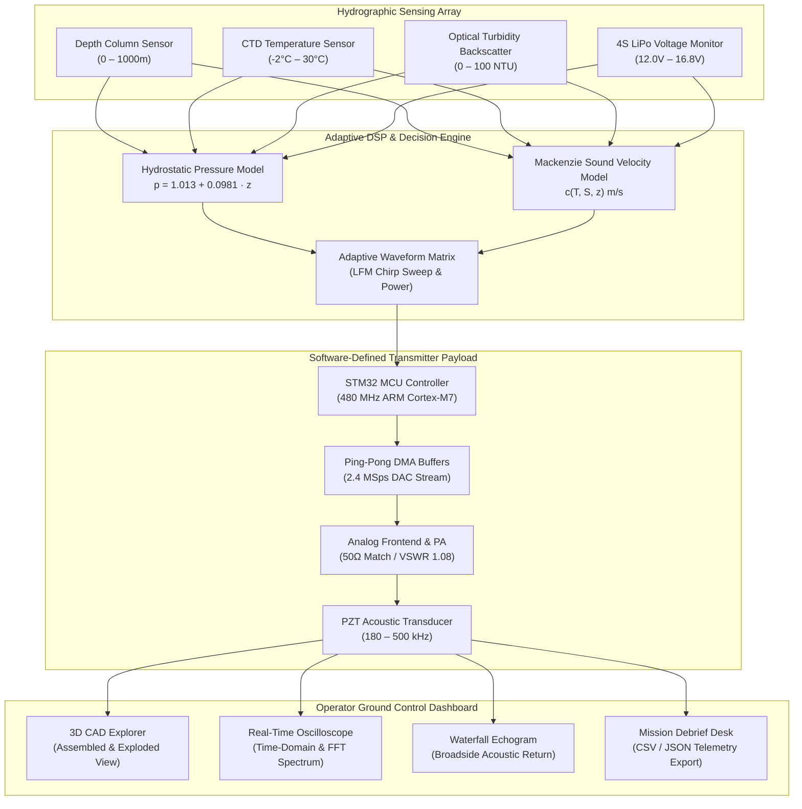

<div align="center">

# AQUACHIRP 🌊
### Autonomous Underwater Vehicle Software-Defined Sonar Telemetry Platform

[](https://react.dev/)
[](https://www.typescriptlang.org/)
[](https://threejs.org/)
[](https://tailwindcss.com/)
[](https://vitejs.dev/)

</div>

---

## 📌 Architectural Overview & Data Flow



---

## ⚡ System Architecture Layers

```
+-------------------------------------------------------------------------------+
|                       OPERATOR GROUND CONTROL DASHBOARD                       |
|   +-------------------+  +--------------------+  +------------------------+   |
|   | 3D AUV Explorer   |  | Live Oscilloscope  |  | Acoustic Waterfall     |   |
|   | (Assembled/Expl.) |  | (Chirp & FFT)      |  | Echogram               |   |
|   +-------------------+  +--------------------+  +------------------------+   |
+---------------------------------------+---------------------------------------+
                                        |  (Bidirectional postMessage Bus)
+---------------------------------------v---------------------------------------+
|                    ADAPTIVE WAVEFORM TRANSMISSION MATRIX                      |
|  +--------------------+  +--------------------+  +-------------------------+  |
|  | PRF-01 (Shallow)   |  | PRF-02 (Thermocli.)|  | PRF-05 (ECO Save <=30%) |  |
|  | 180 -> 220 kHz     |  | 120 -> 160 kHz     |  | 80 -> 110 kHz Low Power |  |
|  +--------------------+  +--------------------+  +-------------------------+  |
+---------------------------------------+---------------------------------------+
                                        |  (SPI / DMA Hardware Stream)
+---------------------------------------v---------------------------------------+
|                    EMBEDDED HARDWARE PAYLOAD SUBSYSTEM                        |
|  +--------------------+  +--------------------+  +-------------------------+  |
|  | STM32 MCU Core     |  | 12-Bit Fast DAC    |  | Transducer Matching PA  |  |
|  | 480 MHz ARM M7     |  | 2.4 MSps Stream    |  | 50 Ohm Impedance        |  |
|  +--------------------+  +--------------------+  +-------------------------+  |
+-------------------------------------------------------------------------------+
```

---

## ✨ Key Platform Features

- 🛸 **Cinematic Boot & Connection Desk**: Clean system startup screen with hardware bus handshake setup and saved mission archives.
- 🔮 **3D Interactive AUV Explorer**: Three.js CAD payload inspection view with assembled and exploded subsystem disassembly modes.
- 🌊 **Real-Time Hydrographic Sensing**: In-situ monitoring of water column depth, CTD temperature, barometric pressure, turbidity clutter, and battery reserves.
- ⚡ **Adaptive Decision Engine**: Automatic LFM Chirp bandwidth ($\Delta f$), sweep rate ($k$), pulse duration ($\tau$), and ECO power mode adjustments upon detecting environmental stress or $\le 30\%$ battery reserves.
- 📈 **Signal Oscilloscope & Waterfall Echogram**: High-resolution time-domain waveform display, 0–700 kHz FFT spectral density curve, and broadside acoustic waterfall returns.
- 📁 **Mission Debrief Desk**: Synchronous telemetry log database with custom waypoint tagging, interactive range filters, and 1-click CSV/JSON export.

---

## 🚀 Quick Start (Run Locally)

**Prerequisites:** Node.js (v18+)

```bash
# 1. Clone the repository
git clone https://github.com/yashkoparde/aquachirp.git

# 2. Navigate to project directory
cd aquachirp

# 3. Install dependencies
npm install

# 4. Start development server
npm run dev
```

Open your browser and navigate to `http://localhost:3000/`.

---

<div align="center">

**AQUACHIRP Engineering Prototype** • Hydrographic Acoustic Telemetry Suite

</div>
